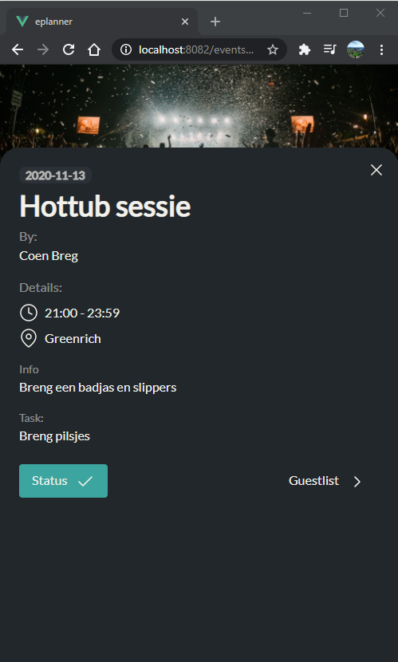

# ePlanner

A Progressive Web App platform where friends can plan events together.

## Description

ePlanner is an app made in a span of 6 weeks. The idea of the app is to make the planning of an evening with friends easier. In those 6 weeks I delivered an MVP.

## App Feel



## Project setup
```
npm install
```

### Compiles and hot-reloads for development
```
npm run serve
```

### Compiles and minifies for production
```
npm run build
```

### Run your unit tests
```
npm run test:unit
```

### Lints and fixes files
```
npm run lint
```
